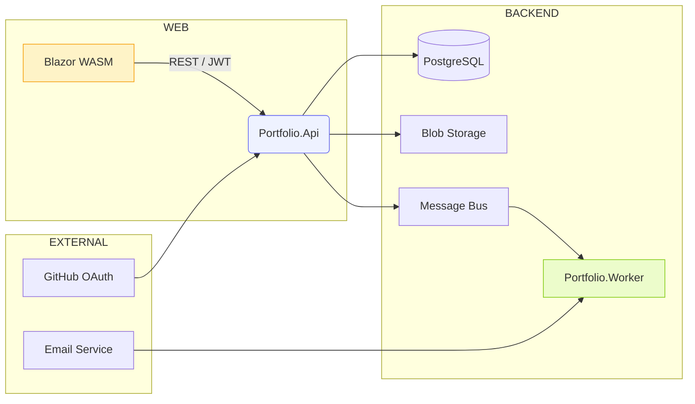

# 🎴 WPDev Portfolio

> Portfólio profissional minimalista e editorial, desenvolvido com .NET 8, Blazor WebAssembly e Clean Architecture.


---

## 🌟 Visão do Produto

Site de portfólio pessoal com **estética editorial premium**, inspirado em estúdios contemporâneos como [diplo.studio](https://www.diplo.studio), apresentando:

- **Home minimalista** com hero forte e tipografia impactante
- **Projetos em destaque** com imagens amplas e layout editorial
- **Cases detalhados** com narrativa visual e storytelling
- **Timeline interativa** com animações suaves de scroll
- **Mini-blog** com posts em Markdown e leitura fluida
- **Seção "O que estou fazendo agora"** dinâmica e atualizável
- **Galeria de imagens** com lightbox contemporâneo
- **Formulário de contato** minimalista e direto
- **Área Admin** completa para gerenciamento de conteúdo

Todo o design segue rigorosamente o **Manual da Marca WPDev**, com cores, tipografia e princípios visuais estabelecidos.

---

## 🏗️ Arquitetura

O projeto segue **Clean Architecture** com separação clara entre camadas:

```
┌─────────────────────────────────────────────────────────┐
│                    Portfolio.Web                        │
│              (Blazor WebAssembly UI)                    │
└─────────────────┬───────────────────────────────────────┘
                  │ HTTP / REST (JWT)
┌─────────────────▼───────────────────────────────────────┐
│                   Portfolio.Api                         │
│            (ASP.NET Core Web API)                       │
└─────────────────┬───────────────────────────────────────┘
                  │
┌─────────────────▼───────────────────────────────────────┐
│               Portfolio.Application                     │
│         (CQRS/MediatR, DTOs, Validators)               │
└─────────────────┬───────────────────────────────────────┘
                  │
┌─────────────────▼───────────────────────────────────────┐
│              Portfolio.Infrastructure                   │
│         (EF Core, Repositories, Services)              │
└─────────────────┬───────────────────────────────────────┘
                  │
┌─────────────────▼───────────────────────────────────────┐
│                  Portfolio.Domain                       │
│            (Entities, Interfaces)                       │
└─────────────────────────────────────────────────────────┘
```

### Fluxo de dados:
**Blazor WASM** → **API (REST + JWT)** → **PostgreSQL** / **Azure Blob** → **Worker (tarefas assíncronas)**

---

## 🚀 Stack Tecnológica

### Backend
- **.NET 8** — Framework principal
- **ASP.NET Core Web API** — REST API
- **Entity Framework Core** — ORM para transações
- **Dapper** — Queries otimizadas (opcional)
- **MediatR** — Padrão CQRS
- **FluentValidation** — Validação de entrada
- **AutoMapper** — Mapeamento objeto-objeto
- **JWT Bearer** — Autenticação

### Frontend
- **Blazor WebAssembly** — SPA framework
- **Tailwind CSS** — Estilização (manual da marca WPDev)
- **Animações CSS** — Transform + opacity para efeitos sutis

### Infraestrutura
- **PostgreSQL 15** — Banco de dados principal
- **Redis** — Cache (opcional)
- **Docker Compose** — Orquestração local
- **Azure Blob Storage** — Armazenamento de mídia
- **MailDev** — Testes de email (desenvolvimento)
- **GitHub Actions** — CI/CD

---

## 📋 Pré-requisitos

- [.NET 8 SDK](https://dotnet.microsoft.com/download/dotnet/8.0)
- [Docker Desktop](https://www.docker.com/products/docker-desktop)
- [Node.js](https://nodejs.org/) (para ferramentas frontend)
- [Git](https://git-scm.com/)

---

## 🎯 Como Executar

### 1. Clone o repositório
```bash
git clone https://github.com/willdev34/wpdev-portfolio.git
cd wpdev-portfolio
```

### 2. Suba os containers Docker
```bash
docker-compose up -d
```

### 3. Restaure as dependências
```bash
dotnet restore
```

### 4. Execute o build
```bash
dotnet build
```

### 5. Execute a aplicação

**API:**
```bash
cd src/Portfolio.Api
dotnet run
```

**Blazor WASM (em outro terminal):**
```bash
cd src/Portfolio.Web
dotnet run
```

Acesse:
- **API**: http://localhost:5277
- **Swagger**: http://localhost:5277/swagger
- **Frontend**: http://localhost:5237

---

## 🔑 Credenciais de Desenvolvimento

### PostgreSQL
- **Host**: `localhost:5432`
- **Database**: `portfolio_dev`
- **User**: `wpdev`
- **Password**: `Dev@2024!`

### pgAdmin
- **URL**: http://localhost:5050
- **Email**: `admin@wpdev.com`
- **Password**: `Admin@2024!`

### MailDev
- **URL**: http://localhost:1080

---

## 📁 Estrutura do Projeto

```
wpdev-portfolio/
├── src/
│   ├── Portfolio.Domain/          # Entidades, enums, interfaces
│   ├── Portfolio.Application/     # DTOs, CQRS, validações, mappings
│   ├── Portfolio.Infrastructure/  # EF Core, repositórios, serviços
│   ├── Portfolio.Api/             # Controllers, autenticação, endpoints
│   ├── Portfolio.Web/             # Blazor WASM UI
│   └── Portfolio.Worker/          # Background jobs (email, thumbnails)
├── tests/
│   ├── Portfolio.UnitTests/       # Testes unitários
│   └── Portfolio.IntegrationTests/# Testes de integração
├── tools/
│   └── DatabaseSetup/             # Scripts de setup do banco
├── docs/                          # Documentação adicional
├── deployments/
│   └── docker/                    # Dockerfiles
├── docker-compose.yml             # Orquestração local
├── Portfolio.sln                  # Solution .NET
└── README.md
```

---

## 🎨 Design — Manual da Marca WPDev

### Cores Principais
| Cor | Hex | Uso |
|-----|-----|-----|
| **WPDev Azul-Primário** | `#6C9EA3` | Acento, links, botões |
| **WPDev Dark** | `#0D1C24` | Fundos escuros, hero |
| **Neutro Claro** | `#F4F7F7` | Fundos claros, blog |
| **Cinza Médio** | `#A3A9AB` | Textos secundários, metadados |

### Tipografia
- **Primária**: **Inter** — UI e corpo de texto
- **Secundária**: **Poppins** — Títulos e destaques

### Princípios de Design
- Minimalista e editorial
- Tipografia grande com respiro visual
- Imagens full-bleed (largura total)
- Animações sutis e cinematográficas
- Navegação limpa inspirada em diplo.studio

---

## 🗺️ Roadmap

### Sprint 0 — Infraestrutura ✅
- [x] Estrutura da solução .NET
- [x] Docker Compose configurado
- [x] PostgreSQL + pgAdmin
- [x] Identity básico

### Sprint 1 — Domain & Database ✅
- [x] Entidades do domínio
- [x] Configuração EF Core
- [x] Schema do banco
- [x] Migrations iniciais

### Sprint 2 — Application Layer 🔄
- [x] DTOs especializados
- [x] AutoMapper profiles
- [ ] Repository Pattern
- [ ] CQRS com MediatR
- [ ] Validações com FluentValidation

### Sprint 3 — API Endpoints
- [ ] Projects CRUD
- [ ] Blog posts
- [ ] Timeline events
- [ ] Gallery images
- [ ] Contact messages

### Sprint 4 — Blazor UI Base
- [ ] Shell e layout principal
- [ ] Home editorial
- [ ] Navegação minimalista

### Sprint 5 — Projetos
- [ ] Listagem de projetos
- [ ] Página de case (detalhes)
- [ ] Filtros e busca

### Sprint 6 — Blog & Timeline
- [ ] Listagem de posts
- [ ] Leitura de post (Markdown)
- [ ] Timeline interativa

### Sprint 7 — Galeria & Contato
- [ ] Gallery com lightbox
- [ ] Upload de imagens
- [ ] Formulário de contato

### Sprint 8 — Autenticação & Admin
- [ ] Login com JWT
- [ ] Área admin protegida
- [ ] CRUD completo

### Sprint 9 — Performance & SEO
- [ ] Otimização de imagens (WebP)
- [ ] Meta tags e OpenGraph
- [ ] Lighthouse score 90+

### Sprint 10 — Deploy & Documentação
- [ ] CI/CD GitHub Actions
- [ ] Deploy Azure
- [ ] Documentação completa

---

## 🧪 Testes

### Executar testes unitários
```bash
dotnet test tests/Portfolio.UnitTests/
```

### Executar testes de integração
```bash
dotnet test tests/Portfolio.IntegrationTests/
```

### Cobertura de código
```bash
dotnet test --collect:"XPlat Code Coverage"
```

---

## 🚢 Deploy

### Docker Build
```bash
docker build -t wpdev-portfolio-api -f src/Portfolio.Api/Dockerfile .
docker build -t wpdev-portfolio-web -f src/Portfolio.Web/Dockerfile .
```

### Azure Deploy (exemplo)
```bash
az webapp create --resource-group wpdev-rg --plan wpdev-plan --name wpdev-api
az webapp deployment source config --name wpdev-api --resource-group wpdev-rg \
  --repo-url https://github.com/willdev34/wpdev-portfolio --branch main
```

---

## 📊 Diagrama Arquitetural



---

## 📄 Licença

Este projeto está sob a licença MIT. Consulte o arquivo `LICENSE` para mais detalhes.

---

## 📞 Contato

**William (Willzin)**
- GitHub: [@willdev34](https://github.com/willdev34)
- LinkedIn: [willdevfull](https://www.linkedin.com/in/willdevfull/)

---

<p align="center">
  <strong>Desenvolvido com 💙 usando .NET 8 e Clean Architecture</strong><br>
  <em>Onde ideias viram produto.</em>
</p>